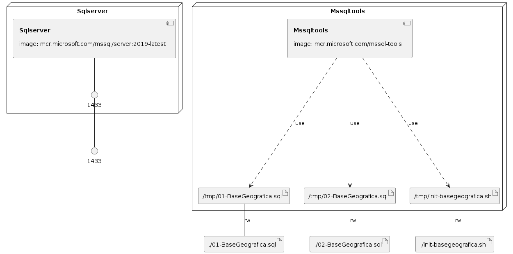

# DockerCompose-SqlServer-DBInitialization_DadosGeograficos
Exemplo de criação de ambiente do SQL Server com Docker Compose, incluindo a execução de scripts de inicialização com a imagem mcr.microsoft.com/mssql-tools.

### Infrastructure model

